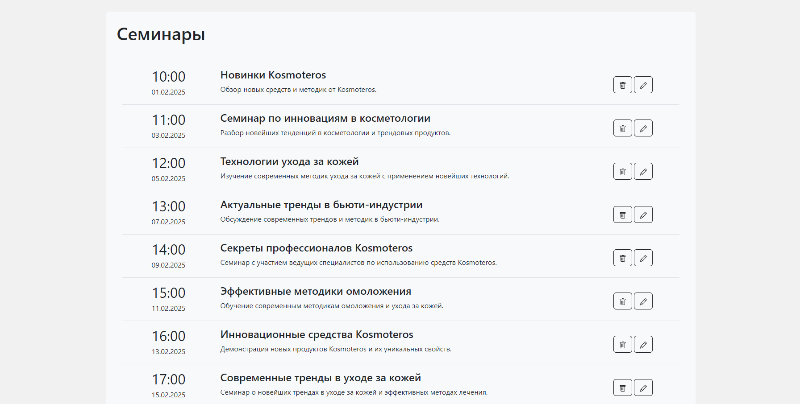

# Тестовое задание ITSTART

Приложение для просмотра, удаления и редактирования семинаров

[Пример приложения](https://itstart-test-task-i2k5.vercel.app/)

## Как использовать

Все команды запускаются из корневой директории. Для демонстрации загрузки добавлены небольшие задержки

Запуск мок сервера:

```
$ npm start
```

Запуск приложения:

```
$ npm run start-frontend
```


